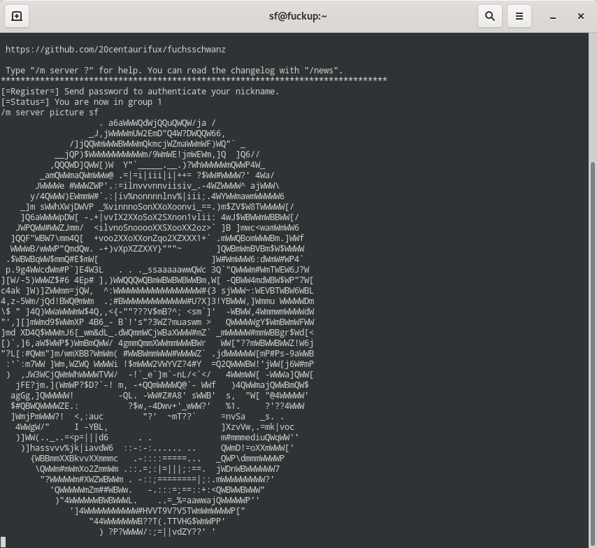

# Fuchsschwanz

Fuchsschwanz is a cross-platform [ICB](http://www.icb.net/) server written in Python.

It's the first ICB server supporting TLS, UTF-8, IPv6 & avatars out of the box.

# Running Fuchsschwanz

You need at least Python 3.7 to start the server. It requires a data directory and
a configuration file.

	$ python3 icbd/icbd.py --config=./config.json --data-dir=$(pwd)/data

The data directory contains help files, news and the message of the day (which
can be an executable!).

The easiest way to start Fuchsschwanz is to start the run.sh script. This will also generate a
self-signed certificate for TLS (this requires openssl).

	$ AUTO_RESPAWN=1 ./run.sh # activate failure recovery

Running for the first time an administrative user will be created. You should
note down the password.

	2019-09-10 ... [icbd] INFO <sqlite.py, line 59> - Initial admin created with password '2vTOAlzv'.

## Dependencies

Fuchsschwanz requires pytz.

	$ python3 -m pip install pytz

# Configuration

Please find below a list with the most important settings.

## server

* hostname: hostname of your server

## bindings

Array containing network bindings (TCP and TLS over TCP).

	"bindings":
	[
		"tcp://localhost",
		"tcps://localhost?cert=./runtime/selfsigned.cert&key=./runtime/selfsigned.key"
	]

## timeouts

* connection: defines after what period of time (seconds) the peer TCP connection
  should be considered unreachable
* ping: a ping message is sent at this regular interval (seconds) if no
  activity from a client connection is detected
* timeBetweenMessages: minimum allowed seconds between two client messages
* idleBoot: default idle-boot setting for new created groups
* idleMod: default idle-mod setting for new created groups

## database

* filename: filename of the internal SQLite database

# Avatar support

To enable avatar support [Pillow](https://python-pillow.org/) and [python-aalib](http://jwilk.net/software/python-aalib/) are required:

	$ python3 -m pip install pillow python-aalib

# Windows issues

By default Fuchsschwanz uses a Unix domain socket for inter-process communication. This
doesn't work on Windows for obvious reasons. Use a TCP connection instead:

	"server":
	{
		"hostname": "localhost",
		"ipc":
		{
			"binding": "tcp://localhost:7328"
		}
	}

# Test server

There's a test server running on [internetcitizens.band](https://internetcitizens.band/).
